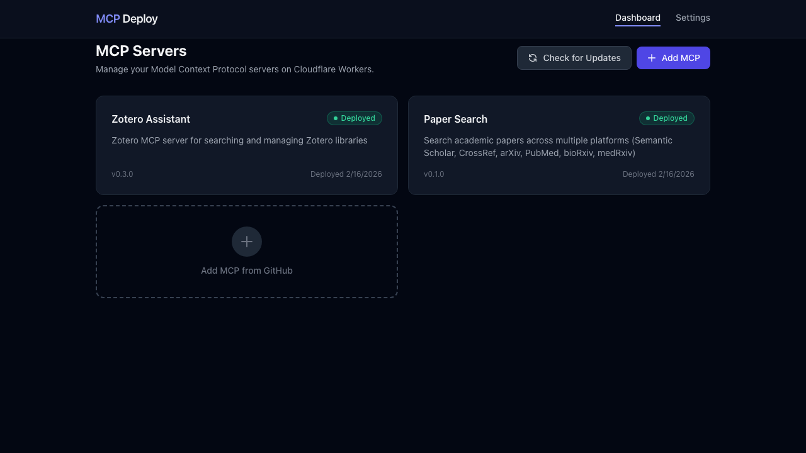
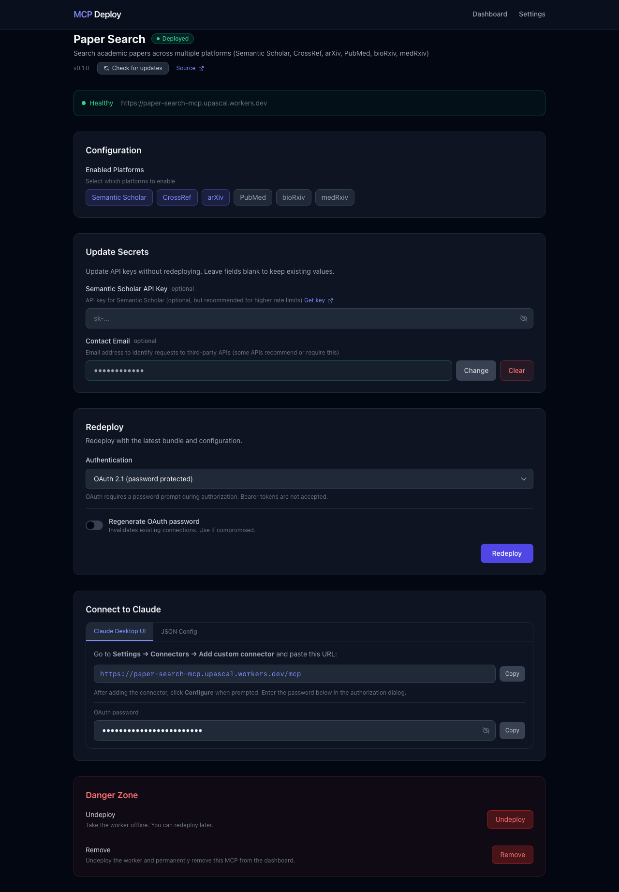
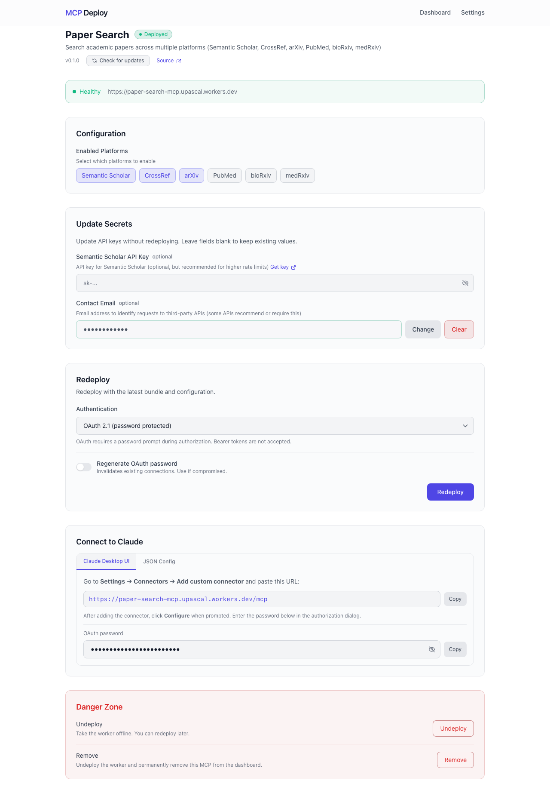
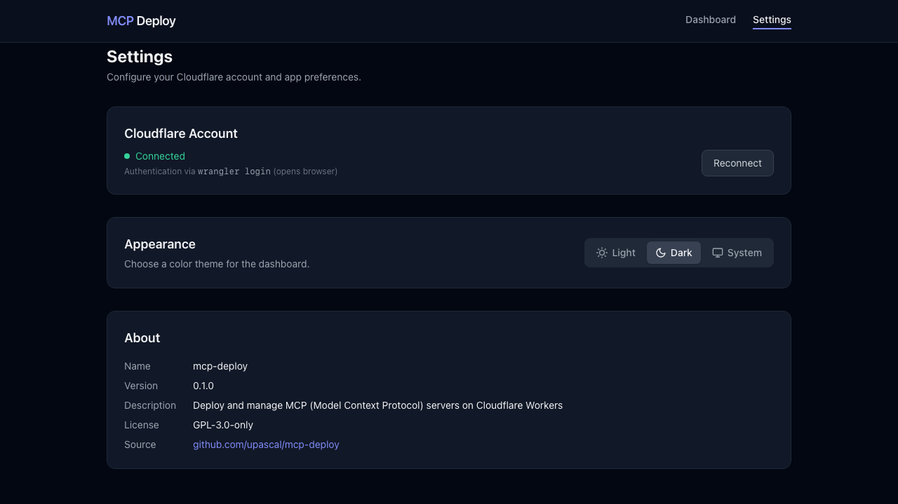

# MCP Deploy

[](https://www.gnu.org/licenses/gpl-3.0)
[](https://github.com/upascal/mcp-deploy)
[](https://nodejs.org/)

A Next.js dashboard for deploying and managing MCP (Model Context Protocol) servers on Cloudflare Workers.



## Install

Requires [Node.js](https://nodejs.org/) 20+ and a [Cloudflare](https://cloudflare.com) account (free tier works).

```bash
git clone https://github.com/upascal/mcp-deploy.git
cd mcp-deploy
npm install
npm link                # Makes `mcp-deploy` available as a global command
```

Then log in to Cloudflare and start the web interface:

```bash
mcp-deploy login        # Opens browser for Cloudflare OAuth
mcp-deploy gui          # Start the web UI at http://localhost:3000
```

Or use the CLI directly:

```bash
mcp-deploy add upascal/paper-search-mcp   # Add an MCP from GitHub
mcp-deploy deploy paper-search-mcp         # Deploy to Cloudflare Workers
mcp-deploy status paper-search-mcp         # Check deployment health
```

> **npm package coming soon** — Once published, `npm install -g mcp-deploy` will replace the clone + link step.

## Features

- **One-Click Deployment** — Deploy MCP servers to Cloudflare Workers with a single click
- **Secure Secrets Management** — AES-256-GCM encrypted storage for API keys and tokens
- **Multiple Auth Modes** — Choose between bearer tokens, OAuth, or open access
- **GitHub Integration** — Fetch MCP servers directly from GitHub releases
- **CLI + Web Interface** — Use the web dashboard or command-line tools
- **No Always-On Server Required** — MCPs run on Cloudflare's edge network
- **Hot Secret Updates** — Change API keys without redeploying
- **Health Monitoring** — Check deployment status and worker health

## What it does

1. Add MCP servers from GitHub releases
2. Configure secrets (API keys, library IDs, etc.)
3. Deploy to Cloudflare Workers with one click
4. Choose authentication mode (bearer, OAuth, or open)
5. Get connection URLs for Claude Desktop and other MCP clients
6. Update secrets without redeploying
7. Monitor health of deployed workers

## Managed MCPs

- **Paper Search MCP** — Search academic papers across Semantic Scholar, CrossRef, arXiv, PubMed, bioRxiv, medRxiv
- **Zotero Assistant MCP** — Manage your Zotero library with 20+ tools

## Quick Start

Open [http://localhost:3000](http://localhost:3000) after running `mcp-deploy gui`:

1. **Add an MCP** -- Paste a GitHub repo URL (must have releases with `mcp-deploy.json` + `worker.mjs`)
2. **Configure** -- Enter any required secrets (API keys, tokens)
3. **Deploy** -- Click Deploy. You'll get back:
   - **MCP URL** (e.g., `https://your-mcp.yoursubdomain.workers.dev/mcp`)
   - **Bearer Token** + **MCP URL with Token** (if you chose bearer auth)
   - **OAuth flow** (if you chose OAuth auth)
   - **Open URL** (if you chose open / no auth)

<details>
<summary>MCP detail page — secrets, auth, connection info</summary>


</details>

<details>
<summary>Light mode</summary>


</details>

<details>
<summary>Settings — Cloudflare account, theme, app info</summary>


</details>

## Connecting to Claude Desktop

1. Deploy an MCP using the web interface
2. In Claude Desktop: **Settings > Connectors > Add custom connector**
3. Paste the URL for the auth mode you chose:
   - **Bearer**: use the **MCP URL with Token** (e.g., `https://your-mcp.workers.dev/mcp/t/{token}`)
   - **OAuth**: use the **MCP URL** (you'll be prompted to authorize with a password)
   - **Open**: use the **MCP URL** (no auth)
4. Click **Connect** -- done!

### OAuth mode

- OAuth runs inside each deployed MCP worker (no always-on mcp-deploy server required).
- If `OAUTH_PASSWORD` is set, that value is used during authorization.
- If not set, mcp-deploy will generate a password at deploy time and show it in the deploy result.

## CLI Usage

All commands (after `npm link` during install):

```bash
mcp-deploy gui [-p PORT]               # Start the web interface (default: 3000)
mcp-deploy list                        # List deployed MCPs
mcp-deploy add <github-repo>           # Add an MCP from GitHub
mcp-deploy remove <slug>               # Remove an MCP
mcp-deploy deploy <slug>               # Deploy an MCP
mcp-deploy status <slug>               # Check MCP status
mcp-deploy secrets:list <slug>         # List configured secret keys
mcp-deploy secrets:set <slug> <key>    # Set a secret (prompts for value)
mcp-deploy secrets:delete <slug> <key> # Delete a secret
mcp-deploy login                       # Login to Cloudflare via wrangler
```

## Architecture

```
┌─────────────────────────────────────────────────────────┐
│  MCP-Deploy Dashboard (Next.js)                         │
│  - React frontend with Tailwind CSS                     │
│  - API routes for deployment orchestration              │
└─────────────────────────────────────────────────────────┘
                          │
                          ▼
┌─────────────────────────────────────────────────────────┐
│  GitHub Releases                                        │
│  - mcp-deploy.json (metadata)                           │
│  - worker.mjs (bundle)                                  │
└─────────────────────────────────────────────────────────┘
                          │
                          ▼
┌─────────────────────────────────────────────────────────┐
│  Cloudflare Workers (deployed via wrangler)             │
│  - Each MCP runs as a Durable Object                    │
│  - Secrets stored securely on Cloudflare                │
└─────────────────────────────────────────────────────────┘
```

### Build vs Deploy

**Deploy time** (user action via dashboard):
- Fetches `mcp-deploy.json` + `worker.mjs` from a GitHub release
- Uploads the worker via `npx wrangler deploy`
- Sets secrets (API keys, bearer token)

### Deployment Flow

```
User clicks Deploy
    ↓
Load MCP from registry → Resolve GitHub release
    ↓
Fetch `worker.mjs` from GitHub
    ↓
Upload to Cloudflare via wrangler CLI
    ↓
Set secrets (API keys, config, bearer token)
    ↓
Store deployment record in local SQLite
    ↓
Return Claude Desktop config snippet
```

### Tech Stack

- **Frontend:** Next.js 16 App Router + Tailwind CSS
- **Backend:** Next.js API routes
- **Storage:** Local SQLite for deployment records + encrypted secrets
- **Deployment:** Cloudflare Workers via `wrangler` CLI
- **Security:** AES-256-GCM encryption for secrets at rest

## Project Structure

```
src/
  app/                    # Pages + API routes
  components/             # React components
  lib/
    mcp-registry.ts       # Registry of managed MCPs
    encryption.ts         # AES-256-GCM for secrets at rest
    db.ts                 # SQLite setup + migrations
    store.ts              # SQLite accessors

scripts/
  bundle-workers.ts       # (unused) local bundling utility
```

## Adding a New MCP

To add an MCP to mcp-deploy's registry:

1. **Add to registry** — In `src/lib/mcp-registry.ts`:
   ```typescript
   {
     slug: "my-mcp",
     githubRepo: "owner/my-mcp",
   }
   ```

2. **Add test connection** (optional) — In `src/app/api/test-connection/route.ts`

**For MCP authors**: If you're building an MCP server and want to make it compatible with mcp-deploy, see the [MCP Release Guide](docs/MCP_RELEASE_GUIDE.md) for instructions on setting up your GitHub releases.

## External Dependencies

The worker bundles come from these repos (via GitHub releases):

| MCP | Source Repo |
|-----|-------------|
| Paper Search | `paper-search-mcp` |
| Zotero Assistant | `zotero-assistant-mcp` |

These repos are required at deploy time for their release assets (`mcp-deploy.json` + `worker.mjs`).

## Contributing

We welcome contributions! Please see [CONTRIBUTING.md](CONTRIBUTING.md) for:

- Development setup instructions
- How to run tests
- Project structure overview
- Coding standards
- Pull request guidelines

To report bugs or request features, open an issue on [GitHub](https://github.com/upascal/mcp-deploy/issues).

For security vulnerabilities, please see [SECURITY.md](SECURITY.md) for responsible disclosure instructions.

## Roadmap

- [x] V1: Dashboard for managing 2 existing MCPs
- [ ] Add more MCPs as they're built
- [ ] Auto-analyze arbitrary MCP repos for Cloudflare compatibility
- [ ] AI-powered secret discovery from source code + README
- [ ] MCP-deploy-MCP (an MCP that helps deploy MCPs)
- [ ] Stats on deployed MCPs

## Advanced

### Development

```bash
npm run dev          # Start dev server with hot reload (Turbopack)
```

### Unlinking

To remove the global `mcp-deploy` command:

```bash
npm unlink -g mcp-deploy
```

### Running Tests

```bash
npx vitest run       # Run all tests
npm run lint         # Run linter
npm run build        # Production build
```

## License

This project is licensed under the GNU General Public License v3.0 - see the [LICENSE](LICENSE) file for details.
